# 仪器资源

### 一、小型设备

#### **1. 掌上低速离心机**

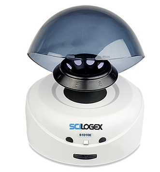

#### **2. 高速离心机**

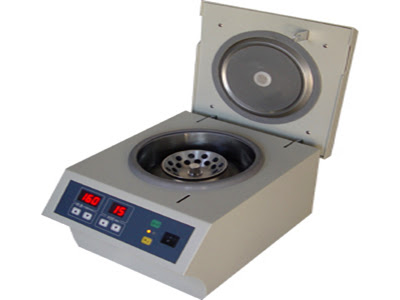

#### **3. 分析天平**

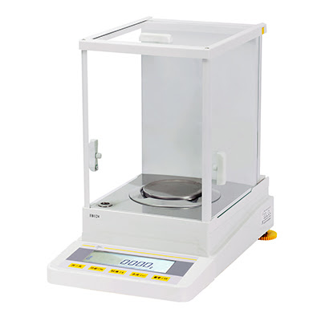

#### **4. LONGER兰格实验室四通道注射泵LSP04-1A**

#### **5. 奥盛MS-100恒温混匀仪**

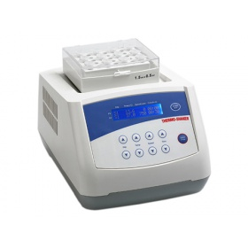

#### **6. 固相萃取装置**

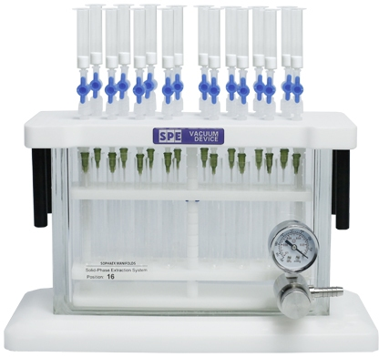

#### **7. 氮气吹干仪**

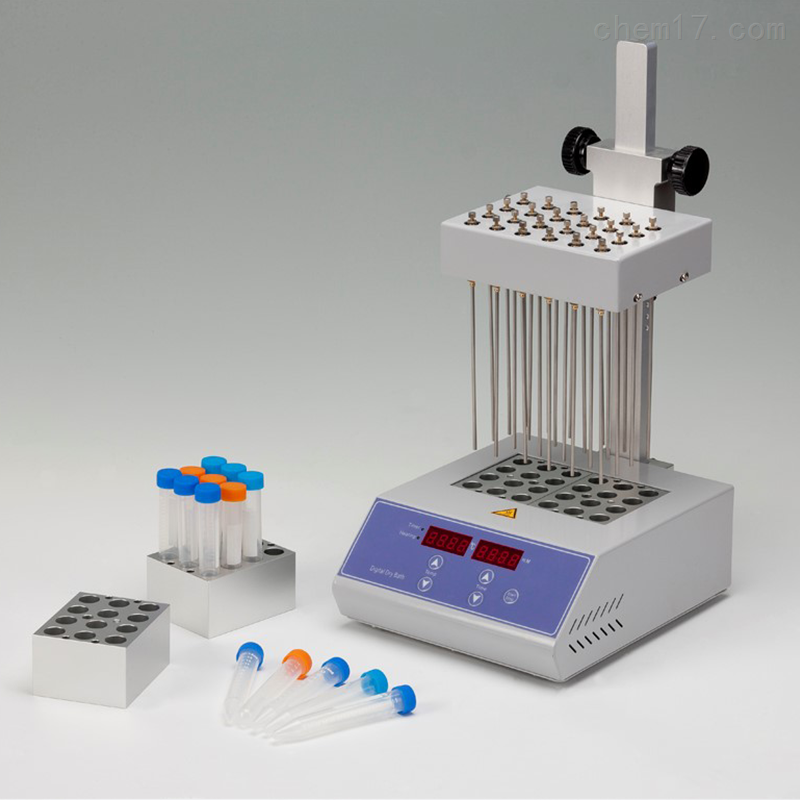

#### **8. 红叶迷你小型空气压缩机和喷笔**

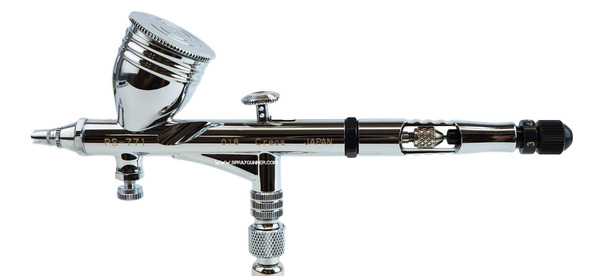

#### **9. 梅特勒-托利多pH计**

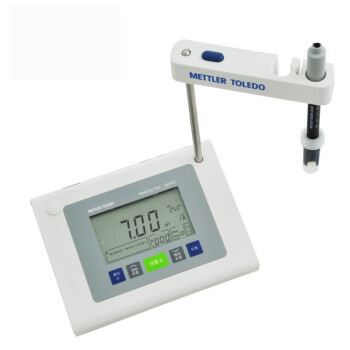

#### **10. 暗箱式紫外分析仪**

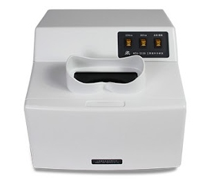

### 二、大型仪器资源

#### **1. Agilent 7890B GC-FID/ECD**

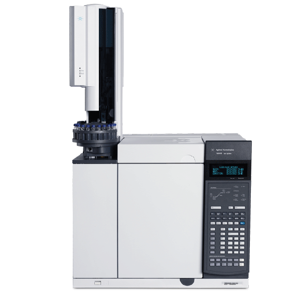

#### **2. Waters Alliance HPLC**

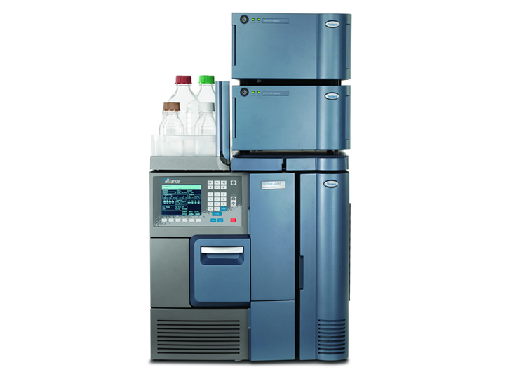

#### **3. Waters ACQUITY TQD Tandem Quadrupole UPLC/MS/MS**

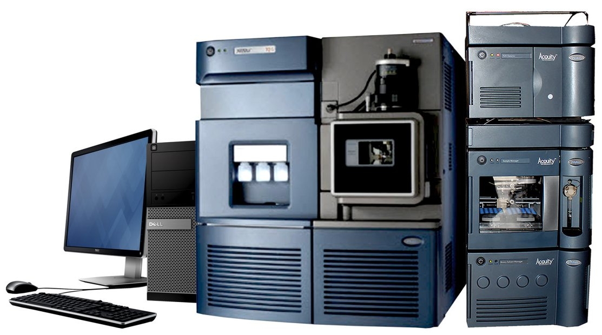

#### **4. Thermo Scientific™ Q Exactive™ GC Orbitrap™ GC-MS/MS**

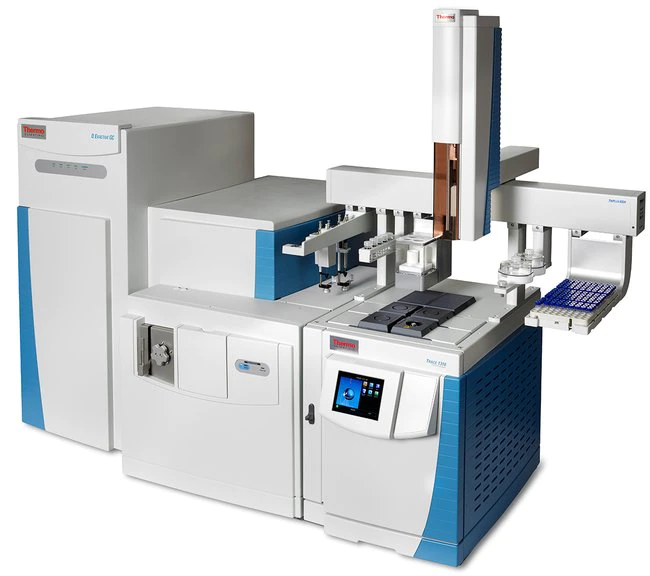

#### **5. Waters SYNAPT G2-Si High Definition Mass Spectrometry**

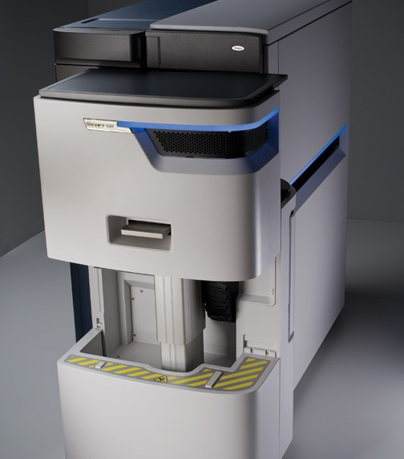

#### **6. Thermo Scientific™ TSQ 9000 - GC-MS/MS System**

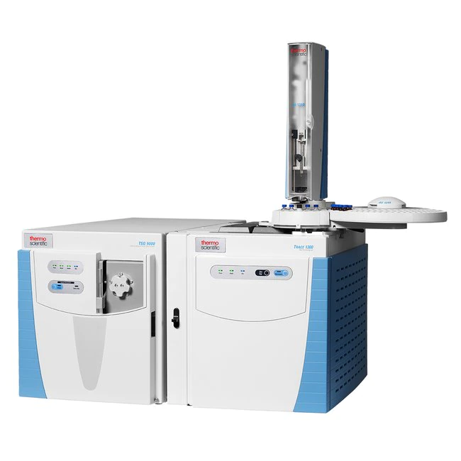