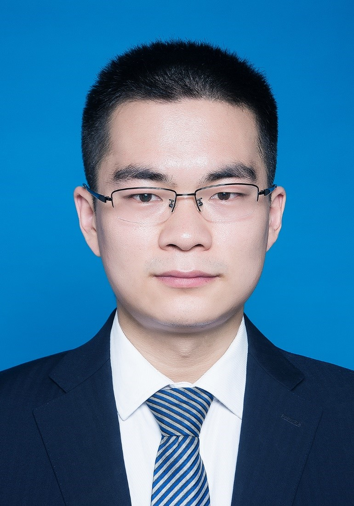

# 陈迪

### **联系方式**

**邮箱:** dichen@zzu.edu.cn；**微信:** chendi20082009

### **工作与教育经历**

2021.03-至今，郑州大学，公共卫生学院，博士后

2019.01-2020.03，The UVic-Genome BC Proteomics Centre (British Columbia, Canana), (Cooperation Supervisor: Dr. Christoph Borchers and Dr. Jun Han)，博士后

2018.07-至今，郑州大学，药学院药物分析系，讲师

2013.09-2018.06，武汉大学，分析化学，博士

2009.09-2013.06，武汉大学，化学基地班，学士

### **主持研究项目**

1. 基于在线富集与原位衍生技术的生物样品中醛类高灵敏度、自动化质谱分析方法研究, 郑州大学青年教师专项科研基金，2019.05-2020.12，主持。
2. 基于MALDI和DESI双源互补质谱成像技术的纳米载体原位药物释放的可视化研究，河南省自然科学基金青年科学基金，2020.01-2021.12，主持。
3. 基于稳定同位素标记技术的定量质谱成像方法及其在纳米药物载体生物组织分布和药物释放可视化研究中的应用，第70中国博士后科学基金面上资助，2021.10-2023.01，主持。

### 工作以来学术成果

### 2022

1. **Di Chen**，Zi-Han Wang，Wei-Qi Cui，Jing-Xian Zhang，Jun-Wei Zhang，De-Qiao Wu，Zi-Yue Wang，Xin-Rui Yu，Yan-Bo Luo，Dilshad Hussain，Xia Xua***，Journal of Chromatography A**, 2022，1667，462891. （中科院小类一区top，IF 4.759）
   https://www.sciencedirect.com/science/article/pii/S0021967322000899
2. **Di Chen**, Man-Yu Zhang, Xin-Miao Bu, Bin Wang, Xin-Li Xu, Sen Yang, Zhi Sun\*，Xia Xu\*，In-syringe cotton fiber-supported liquid extraction coupled with gas chromatography-tandem mass spectrometry for the determination of free 3-mono-chloropropane-1,2-diol in edible oils，**Journal of Chromatography A, Just Accepted. （中科院小类一区top，IF 4.759）
   https://www.sciencedirect.com/science/article/pii/S0021967322002746
3. Nian Shi, Xin-Miao Bu, Man-Yu Zhang, Bin Wang, Xin-Li Xu, Dilshad Hussain\*, Xia Xu\*, **Di Chen\***, Current Sample Preparation Methodologies for Determination of Catecholamines and Their Metabolites in Bio-Samples, Molecules, 2022, 27(9), 2702. （中科院三区top，IF 4.412）
   https://www.mdpi.com/1420-3049/27/9/2702
4. Xin-Miao Bu#, Nian Shi#, Man-Yu Zhang, De-Qiao Wu, Wu-Duo Zhao\*,  Xia Xu\*, **Di Chen\***, High-throughput quantitative MALDI-HRMS assay for screening anabolic-androgenic steroids in healthy foods based on Girard’s reagent P and *d5*-Girard’s reagent P labeling，**Analytical and Bioanalytical Chemistry**, under Review.
5. **Di Chen**, Xin-Miao Bu, Man-Yu Zhang, Xin-Li Xu, Bin Wang, Yu-Mei Gan, Kai-Xuan Li, Xia Xu\*, Jun Han\*, Nian Shi\*, On-tissue pyrene-1-boronic acid labelling assisted MALDI imaging of catecholamines in porcine adrenal gland sections, submitted.
6. Honglei Wang, Xueting Liu, Kai-Xuan Li, Dilshad Hussain\*, **Di Chen\***, Current Analytical Strategies for the Determination of Synthetic Antioxidants in Edible Oils,  submitted.
7. 杜斌,姚寒春,周婕,杨森,**陈迪**. 探索混合式教学中课程思政的实施路径——以色谱分析课程为例, 高教学刊. 2022(03):199-202
   https://www.cnki.net/kcms/detail/detail.aspx?DbCode=CJFD&dbname=CJFDLAST2022&filename=GJXK202203049

### 2021

1. **Di Chen**, Jing-Xian Zhang, Wei-Qi Cui, Jun-Wei Zhang, De-Qiao Wu, Xin-Rui Yu, Yan-Bo Luo, Xing-Yi Jiang, Feng-Peng Zhu, Dilshad Hussain, Xia Xu*, A simultaneous extraction/derivatization strategy coupled with liquid chromatography–tandem mass spectrometry for the determination of free catecholamines in biological fluids, **Journal of Chromatography A**, 2021, 1654, 462474.（中科院一区top，IF 4.759）
   https://doi.org/10.1016/j.chroma.2021.462474

2. Wen-Chao Han, Nian Shi, Xin-Ying Wang, Zi-Han Wang, Kai-Li Wang, Ming Gao, Lei Yu, **Di Chen\***, Xia Xu*, Application of Natural Cotton Fibers as an Extraction Sorbent for the Detection of trans-Resveratrol in Adulterated Peanut Oils. **Food Chemistry**, 2021, 339, 127885.（中科院一区top，IF 7.514）

   http://dx.doi.org/10.1016/j.foodchem.2020.127885

3. Zi-Han Wang, Jing-Xian Zhang, Ming Gao, Wei-Qi Cui, Lu Xu, Xiao-lin Zhu, Jin-Jin Li, Zhi-E Huang, Dilshad Hussain, Jing-Yu Zhang, **Di Chen\***, Xia Xu*, Stable isotope labelling-flow injection analysis-mass spectrometry for rapid and high throughput quantitative analysis of 5-hydroxymethylfurfural in drinks, **Food Control** 2021, 130, 108386.（中科院一区top，IF 5.548）
   https://doi.org/10.1016/j.foodcont.2021.108386

### 2020

1. **Di Chen**, Jun Han*, David Schibli, Juncong Yang, Zhenzhong Zhang, Christoph H. Borchers, Supermolecule-assisted imaging of low-molecular-weight quaternary-ammonium compounds by MALDI-MS of their non-covalent complexes with cucurbit[7]uril. **RSC Advances**, 2020, 10 (56), 34261.（中科院三区，IF 3.361）
   http://dx.doi.org/10.1039/D0RA04604C

### **前期成果**

1. Shao-Ting Wang, **Di Chen**, Jun Ding, Bi-Feng Yuan, Yu-Qi Feng*, Borated titania, a new option for the selective enrichment of cis-diol biomolecules. **Chemistry – A European Journal**, 2013, 19, 606-612. 

   http://dx.doi.org/10.1002/chem.201203109

2. **Di Chen**, Yun-Qing Huang, Xioao-Mei He, Zhi-Guo Shi, Yu-Qi Feng*, Coupling carbon nanotube film microextraction with desorption corona beam ionization for rapid analysis of Sudan dyes (I-IV) and Rhodamine B in chilli oil. **Analyst**, 2015, 140, 1731-1738. 
   http://dx.doi.org/10.1039/C4AN02044H

3. **Di Chen**, Hao-Bo. Zheng, Yun-Qing Huang, Yu-Ning Hu, Qiong-Wei Yu, Bi-Feng Yuan, Yiu-Qi Feng*, Magnetic solid phase extraction coupled with desorption corona beam ionization-mass spectrometry for rapid analysis of antidepressants in human body fluids. **Analyst**, 2015, 140, 5662-5670. 
   http://dx.doi.org/10.1039/C5AN00992H

4. **Di Chen**, Yu-Ning Hu, Dilshad Hussain, Gang-Tian Zhu, Yun-Qing Huang, Yu-Qi Feng*, Electrospun fibrous thin film microextraction coupled with desorption corona beam ionization-mass spectrometry for rapid analysis of antidepressants in human plasma. **Talanta**, 2016, 152, 188-195. 

   http://dx.doi.org/10.1016/j.talanta.2016.02.003

5. **Di Chen#**, Jun Ding#, Ming Ke Wu, Tian Yi Zhang, Chu Bo Qi, Yu-Qi Feng*, A liquid chromatography–mass spectrometry method based on post column derivatization for automated analysis of urinary hexanal and heptanal, **Journal of Chromatogrraphy A**, 1493 (2017) 57. (# co-first authors)

   http://dx.doi.org/10.1016/j.chroma.2017.02.071

6. Yu-Ning Hu**#**, **Di Chen#**, Tian-Yi Zhang, Jun Ding, Yu-Qi Feng*, Use of ammonium sulfite as a post-column derivatization reagent for rapid detection and quantification of aldehydes by LC-MS, **Talanta**, 2020, 206, 120172. (# co-first author) 

   http://dx.doi.org/10.1016/j.talanta.2019.120172
   
7. 冯钰锜, **陈迪**, 粉末状磁性吸附剂与常压质谱源的联用分析方法, 专利号: ZL201510055403.0
   https://patents.google.com/patent/CN104677976A/zh

8. **陈迪**, 郑浩博, 余琼卫, 等. 磁固相萃取结合解吸电晕束电离质谱用于体液中的三种抗抑郁药的快速分析[C]//中国化学会第二届全国质谱分析学术报告会会议摘要集. 2015.
   https://kns.cnki.net/kcms/detail/detail.aspx?FileName=ZGHY201510001246&DbName=CPFD2016

9. **陈迪,** 丁俊, 漆楚波, 等. 基于管内固相微萃取与柱后衍生技术的尿液中己醛和庚醛的高效液相色谱-质谱分析方法[C]//第 21 届全国色谱学术报告会及仪器展览会会议论文集. 2017.
   https://kns.cnki.net/kcms/detail/detail.aspx?FileName=ZGHY201705003108&DbName=CPFD2018

### **更多**

1. Researchgate
   https://www.researchgate.net/profile/Chen_Di2

2. Google scholar
   https://scholar.google.com/citations?user=dp2a1jcAAAAJ&hl=zh-CN

