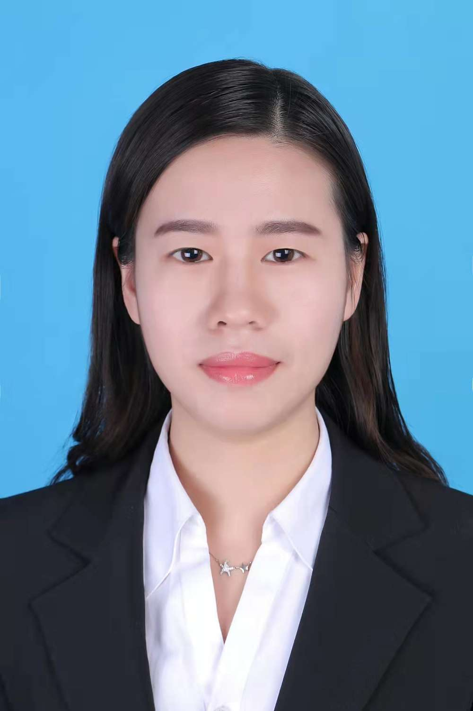
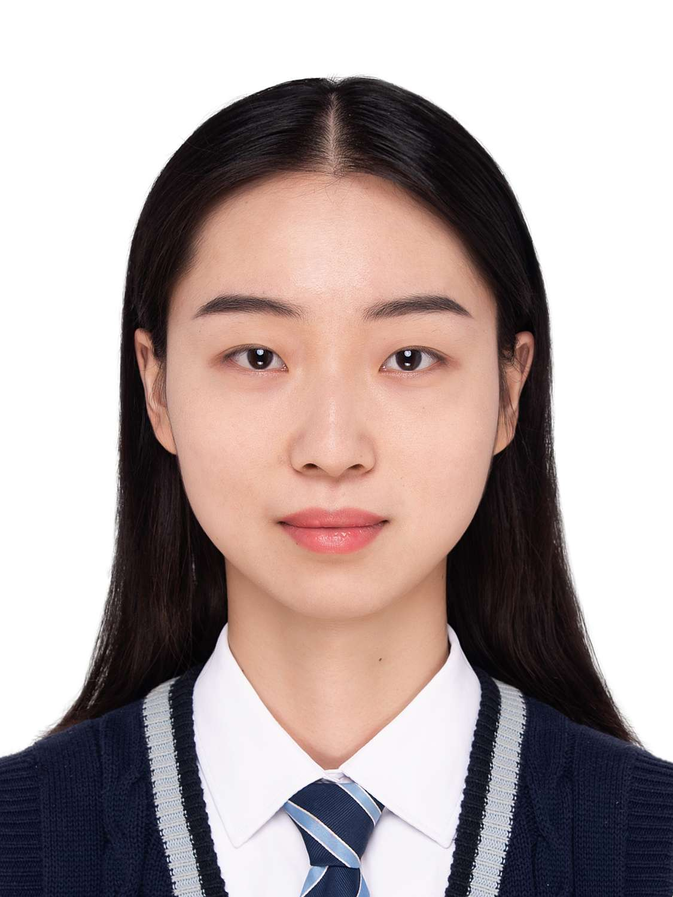
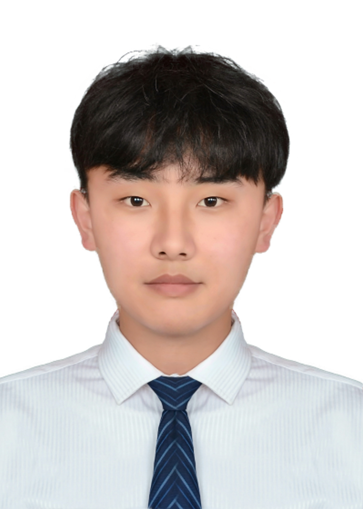

# 在读研究生

# 2020级研究生

## 卜鑫淼

<<<<<<< HEAD

=======

>>>>>>> 2017c524ff2e4ce505d9a97c63ddcc933eae4d45

籍		贯：河南周口

研究方向：

毕业院校：郑州华信学院

## 张曼玉

<<<<<<< HEAD

=======

>>>>>>> 2017c524ff2e4ce505d9a97c63ddcc933eae4d45

籍		贯：河南荥阳

研究方向：

本科院校：河南中医药大学

# 2021级研究生

## 徐鑫丽

<<<<<<< HEAD

=======

>>>>>>> 2017c524ff2e4ce505d9a97c63ddcc933eae4d45

籍		贯：河南许昌

研究方向：

本科院校：河南大学

## 王彬

<<<<<<< HEAD

=======

>>>>>>> 2017c524ff2e4ce505d9a97c63ddcc933eae4d45

籍		贯：新疆

研究方向：

本科院校：陕西科技大学

# 2022级研究生

## 刘雨微

籍		贯：

研究方向：

本科院校：郑州大学

## 黎文轩

籍		贯：

研究方向：

本科院校：河南理工大学
