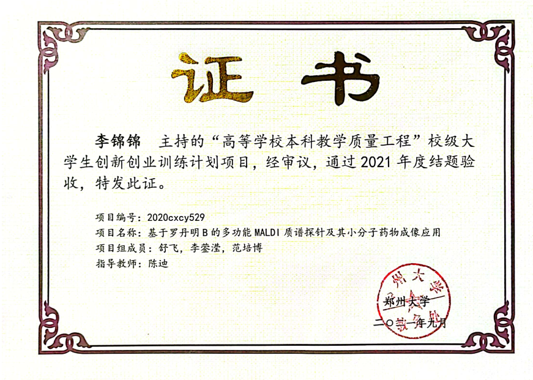
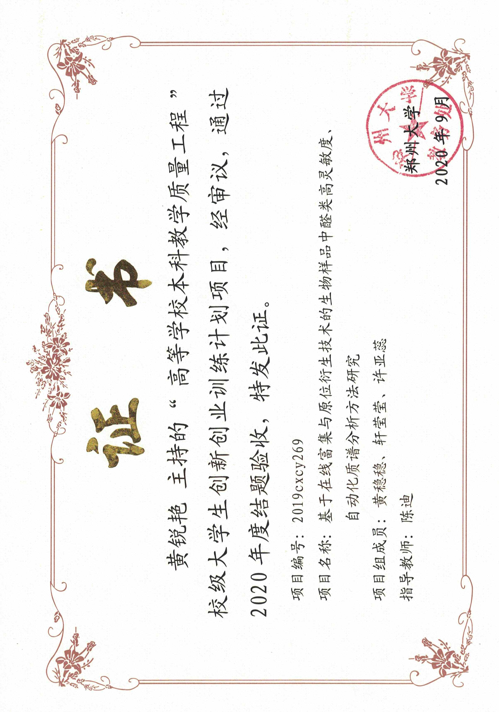
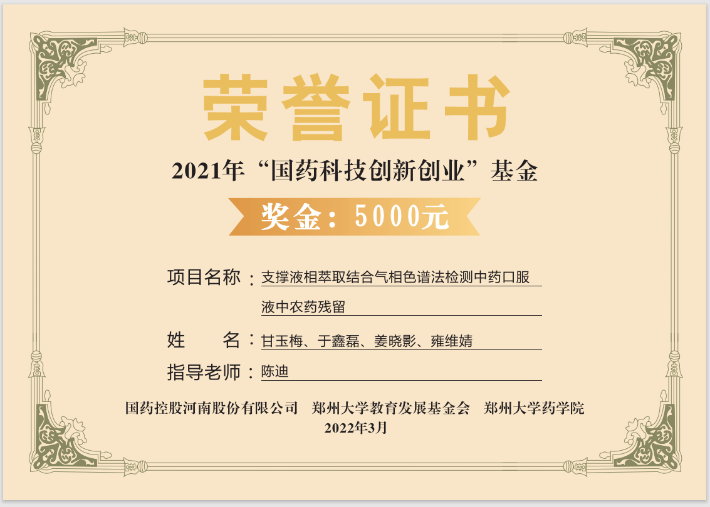

# 创新创业竞赛

## 一、大学生创新创业训练计划

### 2022年大学生创新创业训练计划项目

**项目负责人：**甘玉梅

**团队成员：**夏付云、姜川梅、栗凯旋、刘云鹏

**项目名称：**甾醇激素质谱检测试剂盒的开发及其在多囊卵巢综合征诊断中的应用

**指导老师：**陈迪

### 2021年大学生创新创业训练计划项目

**项目负责人：**于鑫蕊

**团队成员：**雍维婧、张娟、杨萍、姜晓影

**项目名称：**棉花支撑液相萃取结合气相色谱法检测果汁中农药残留

**指导老师：**陈迪

### 2020年大学生创新创业训练计划项目

**项目负责人：**李锦锦

**团队成员：**舒飞、李蓥滢、范培博

**项目名称：**基于罗丹明B的多功能MALDI质谱探针及其小分子药物成像应用

**指导老师：**陈迪

### 2019年大学生创新创业训练计划项目

**项目负责人：**黄锐艳

**团队成员：**黄稳稳、轩莹莹、许亚蕊

**项目名称：**基于在线富集与原位衍生技术的生物样品中醛类高灵敏度、自动化质谱分析方法研究

**指导老师：**陈迪

## 二、国药集团资助创新创业计划

### 2022年度国药集团资助创新创业计划项目

**项目负责人：**甘玉梅

**团队成员：**于鑫蕊、姜晓影、雍维婧

**项目名称：**支撑液相萃取结合气相色谱法检测中药口服液中农药残留

**指导老师：**陈迪

## 三、大学生电子商务“创新、创意及创业”挑战赛

### 2022年大学生电子商务“创新、创意及创业”挑战赛

**项目负责人：**王奕

**团队成员：**于鑫蕊、姜晓影、雍维婧

**项目名称：**支撑液相萃取结合气相色谱法检测中药口服液中农药残留

**指导老师：**陈迪

## 四、“挑战杯”大学生系列科技学术竞赛

### 2022年“挑战杯”大学生创业计划竞赛

**项目负责人：**王奕

**团队成员：**于鑫蕊、姜晓影、雍维婧

**项目名称：**支撑液相萃取结合气相色谱法检测中药口服液中农药残留

**指导老师：**陈迪

## 五、研究生创新创业大赛

### 2021年度郑州大学第六届研究生创新创业大赛

## 六、研究生自主创新项目

### 2021年郑州大学研究生自主创新项目

**项目负责人：**张曼玉

**团队成员：**王彬、薛慧敏

**项目类别：**发明创造类项目

**项目名称：**新型干血吸头产品及其应用开发

**指导老师：**陈迪

### 2018年郑州大学研究生自主创新项目

**项目负责人：**韩文超

**项目类别：**发明创造类项目

**项目名称：**酪氨酸代谢通路中代谢物儿茶酚胺类物质的 测定方法研究及其在肿瘤诊断中的应用

**指导老师：**徐霞、陈迪
